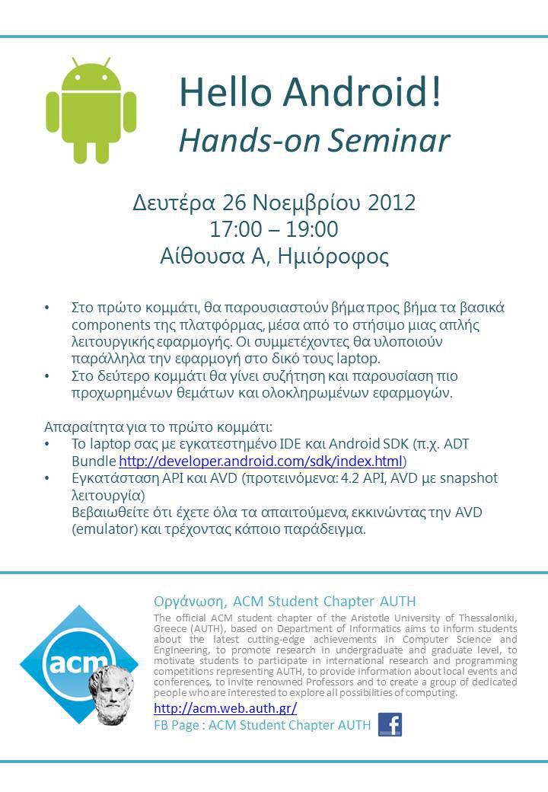

Hello Android: Hands-on Seminar

Introduction to Android programming by chapter members George Piskas and Evangelos Motesnitsalis on Monday November 26th, 2012

Attendance: Over **80 students** (undergraduate AUTH, postgraduate and MSc AUTH & TEITHESS) attended

## Slides

* [Introduction to Android](../assets/hello-android-seminar/helloandroid_motesnits.pdf)
* [Hands-on Tutorial](../assets/hello-android-seminar/helloandroid_piskasg.pdf)
* [Application Presentation: Crydev, Tichu](../assets/hello-android-seminar/apps_piskasg.pdf)

[Source Code](../assets/hello-android-seminar/HelloAndroid_SourceCode.zip)

