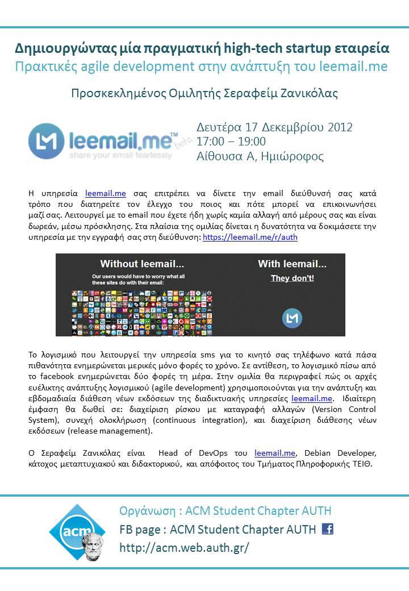

Creating a real-life high-tech startup using Agile development by Serafeim Zanikolas _(head of DevOps at [leemail.me](https://leemail.me))_ on Monday December 17th, 2012

## Resources

* [​Slides](../assets/agile-development-zerafeim-zanikolas/leemail-auth.pdf)
* [leemail.me](https://leemail.me)

Facebook [event page](https://www.facebook.com/events/518212698189276/)

