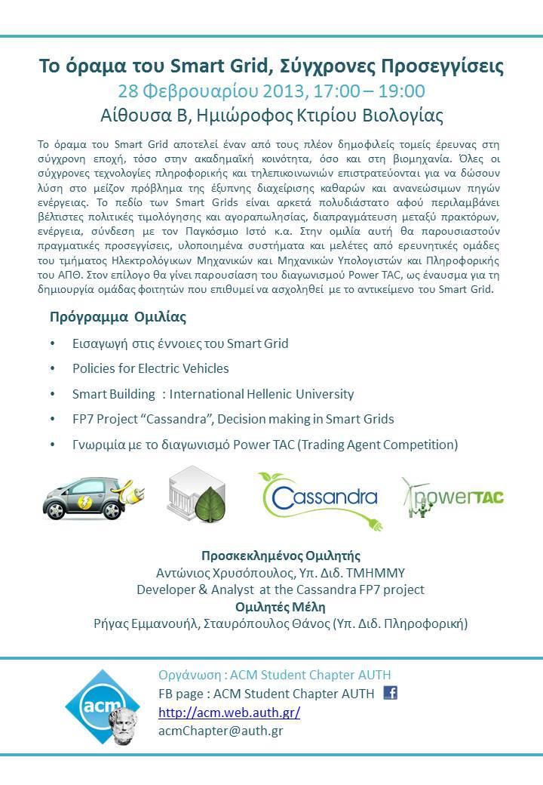

In this lecture we present current, real-world applications of the Smart Grid implemented by research groups of our university.Our department and chapter is honoured to host a fellow Phd-canditate from the Electical Engineering department, Anthony Chrysopoulos, who is an expert in Smart Grids, developer and analyst at the Cassandra FP7 project, and greatly involved with the Power TAC Competition.  
Specifically, this lecture's topics include:

* Introduction to the Concepts of the Smart Grid
* Policies for Electric Vehicles
* Smart Building: International Hellenic University
* Decision Making in Smard Grids, FP7 project "Cassandra"
* PowerTAC (Trading Agent Competition)

**Invited Speaker:** Anthony Chrysopoulos, _Developer & Analyst at the Cassandra FP7 project, EE PhD Candidate_

**ACM AUTH SC Speakers:** Rigas Emmanuouil, Stavropoulos Thanos _(CS PhD Candidates)_

## Slides:

* [Introduction & Electic Vehicles](../assets/smart-grid-vision/ACM_SmartGrid_Intro_and_ElectricCars.pdf)
* [Cassandra](../assets/smart-grid-vision/ACM_SmartGrid_Cassandra.pdf)
* [PowerTAC](../assets/smart-grid-vision/ACM_SmartGrid_PowerTAC.pdf)
* [SmartIHU](../assets/smart-grid-vision/ACM_SmartGrid_SmartIHUpresentation-2013.pdf)

Facebook [event page](https://www.facebook.com/events/274854849311442/)

