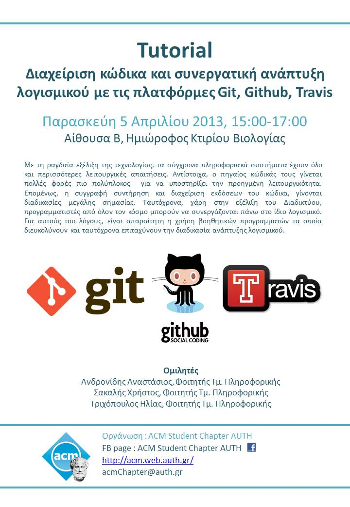

on Friday, 5th of April 2013, from 15:00 to 17:00 in Classroom B, Mezzanine of the Biology Building

Attended by **~30 students**

Due to the rapid evolution of technology and computers, modern software is able to perform more and more complex functions. This plurality of functions naturally reflects to the rising complexity and size of source code. Simultaneously, the widespread usage of the Internet, enables developers worldwide to be involved in the same software project. The above issues, necessitate the use of specialized software to utilize and expedite the software development process.

## Tutorials

* Using Git to manage your code
* Using the Github hosting platform for sharing your code and working with other developers
* Using the Travis continuous integration platform for expediting your development process

## Speakers:

* Andronidis Anastasis
* Christos Sakalis
* Trichopoulos Ilias

## Material:

* [Excellent Guides (including Tutorials and Videos) on How to Use Git](http://git-scm.com/documentation)
* [Git Presentation Slides](../assets/scm-and-collaborative-coding-git-github-travis/presentation.pdf)

