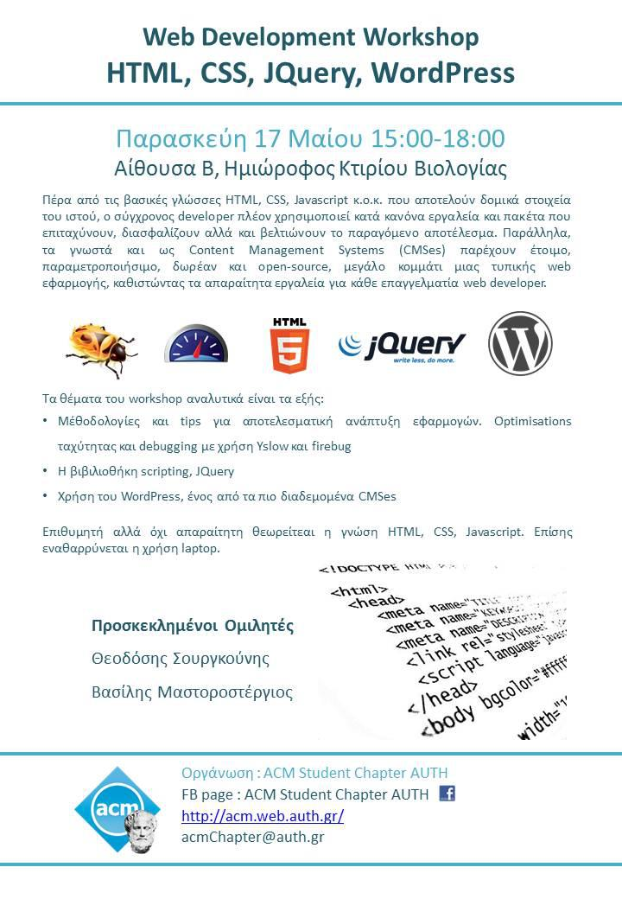

_on Friday, 17th of May 2013, from 15:00 to 18:00 in Classroom B, Mezzanine of the Biology Building_

Attended by **~45 students**

Due to the rapid development of the World Wide Web, web programming is a skill every computer scientist should possess. However, basic knowledge of HTML, CSS and Javascript is not enough as there are many pitfalls to be avoided and many programming guidelines that should be followed. At the same time, Content Management Systems (CMS) facilitate the creation and management of professional websites and are considered an alternative option for web development.

Topics presented:

* Efficient methods for developing web applications
* JQuery, a library that greatly simplifies the client-side scripting of web applications (AJAX)
* Wordpress, the most commonly used CMS

Invited Speakers:

* Theodosis Sourgkounis
* Vassilis Mastorostergios

Slides:

* [Frontend Optimization](../assets/web-development-html-css-jquery-worpress-basics/frontend.pdf)
* [jQuery](../assets/web-development-html-css-jquery-worpress-basics/jQuery.pdf)
* [WordPress](../assets/web-development-html-css-jquery-worpress-basics/slides_wordpress_vmasto.pdf)

Facebook [event page](https://www.facebook.com/events/154704771368378/)

