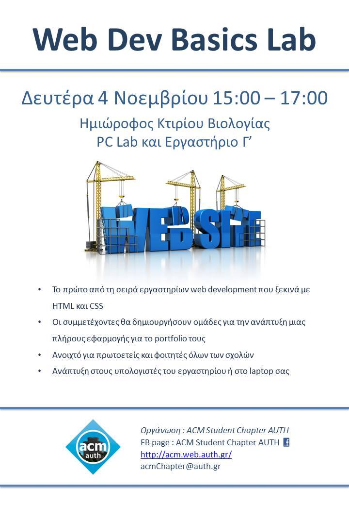

On Monday, 4th of November 2013, from 15:00 to 17:00 in PCLAB and Lab C, Mezzanine of the Biology Building

Attended by 56 students

* Slides: [HTML+CSS](../assets/web-workshop-html-css-basics/web-seminar-I-html+css.pdf)
* Files: [Complete](../assets/web-workshop-html-css-basics/Web-Dev-1.rar) (Index.html, images and Examples)

* This is the first lab of a web development lab series starting with the basics: HTML and CSS
* Participants will create teams in order to create a full web app for their portfolio.
* This series is intended for first year undergraduates of the Department of Informatics and everyone else who wants to attend an introduction on web development
* The lab's computers will be available for students with Institutional Accounts but you are welcome to bring your own laptop too
​

