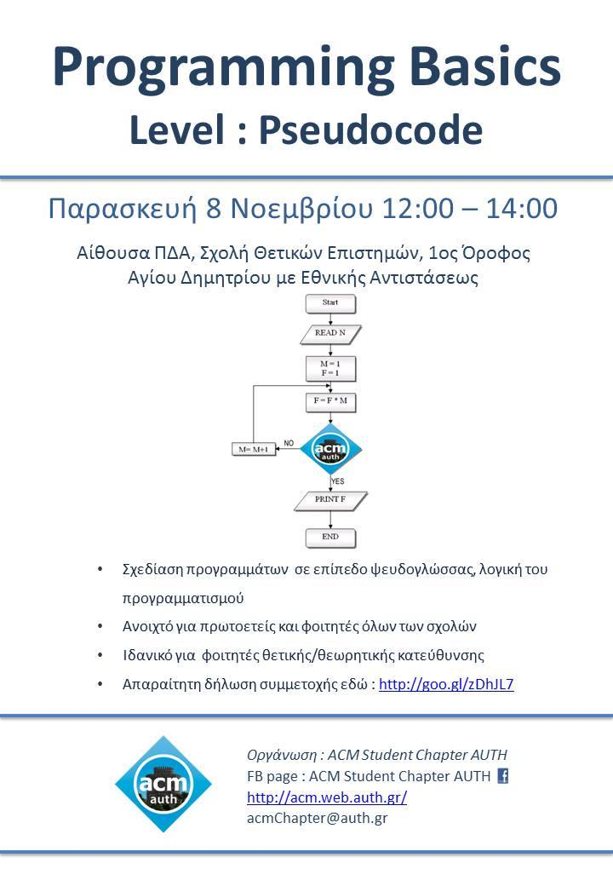

_On Friday, 8th of November 2013, from 12:00 to 14:00 in classroom ΠΔΑ, 1st floor of the Faculty of Sciences building_

Attended by **10 students**

Design of programs at the level of pseudocode, logic of programming.

* Open to first-year students of all faculties.
* Ideal for students of positive / theoretical direction.
* Required entry form [here](http://goo.gl/zDhJL7)
* Material: [Programming Basics 1](../assets/programming-basics-level-pseudocode/Programming-Basics.pdf)

