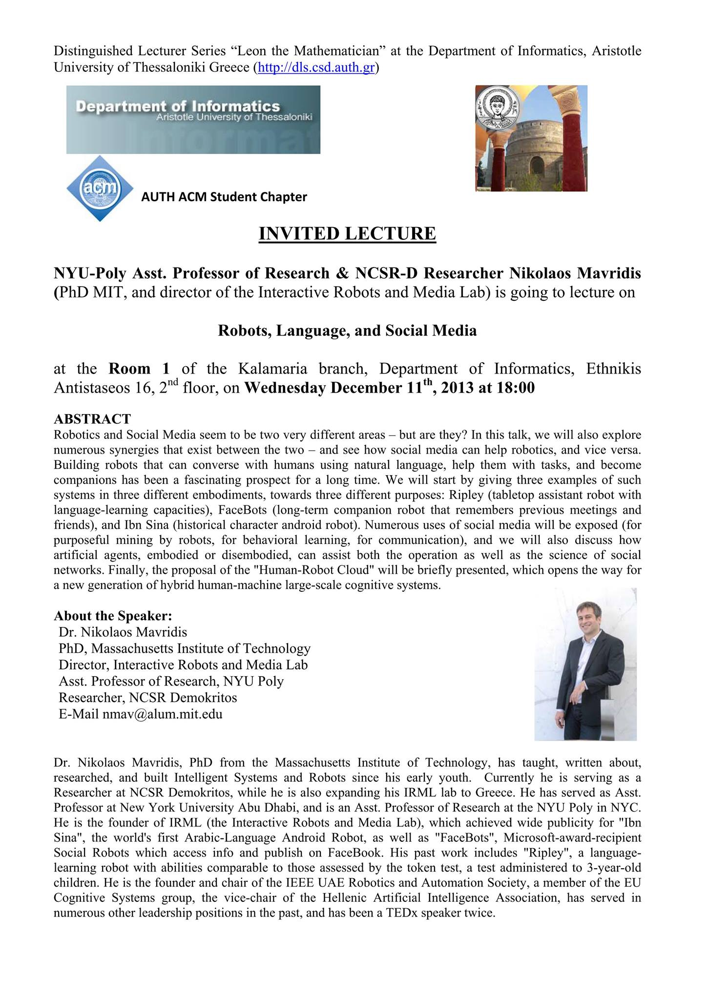

On Wednesday, 11/12/2013, at 6pm, classroom 1, Annex Kalamarias (address: Ethnikis Antistaseos 16), a lecture will be given by Professor Nikolaos Mavridis, graduate of MIT, Asst. Professor and Director of the Laboratory Interactive Robots and Media Lab" of NY University as part of a series of distinguished speakers of MSc, Department of Informatics on: "Robots, Language, and Social Media" (_abstract [attached]())_

