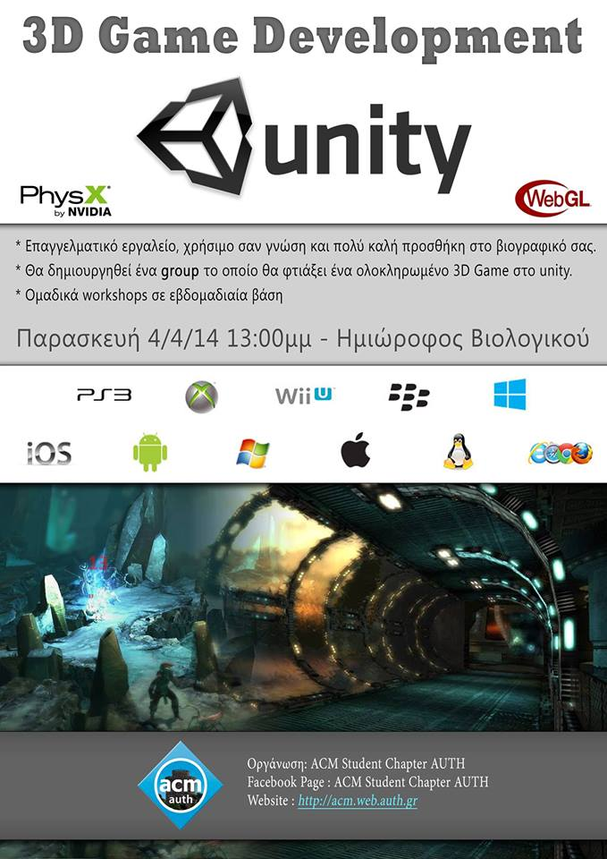
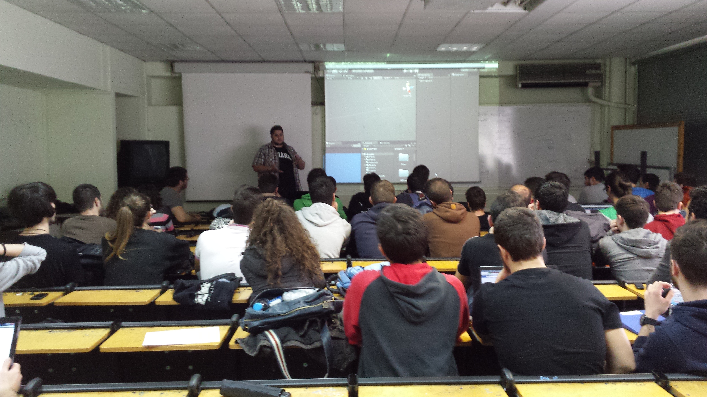
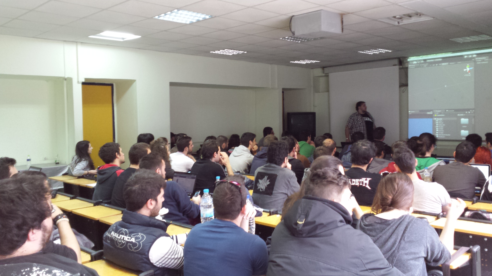

This event's purpose was twofold:
* to present the Unity 3D Game Development platform to anyone interested
* to form a Unity Development team by chapter members and member candidates

Miltos Nedelkos (Vice Chair) presented the event, in a gaming development tutorial scenario. 

Attendance and interest was overwhelming, attracting around fifty students of various departments and universities.

Here you can find material to recreate the tutorial presented or even join our [Unity Team](/teams/unity-team).

Facebook [Event Page](https://www.facebook.com/events/237207026471138)

