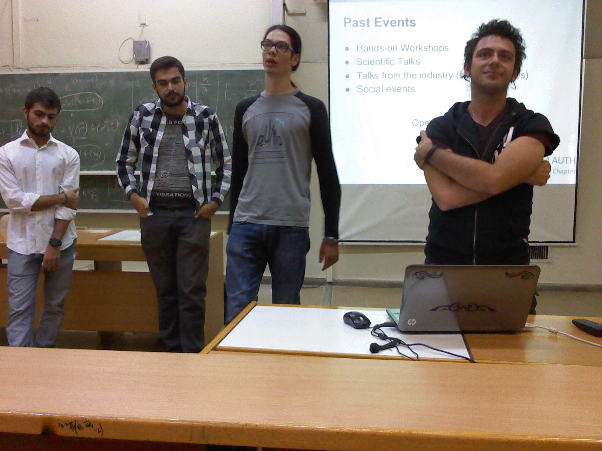
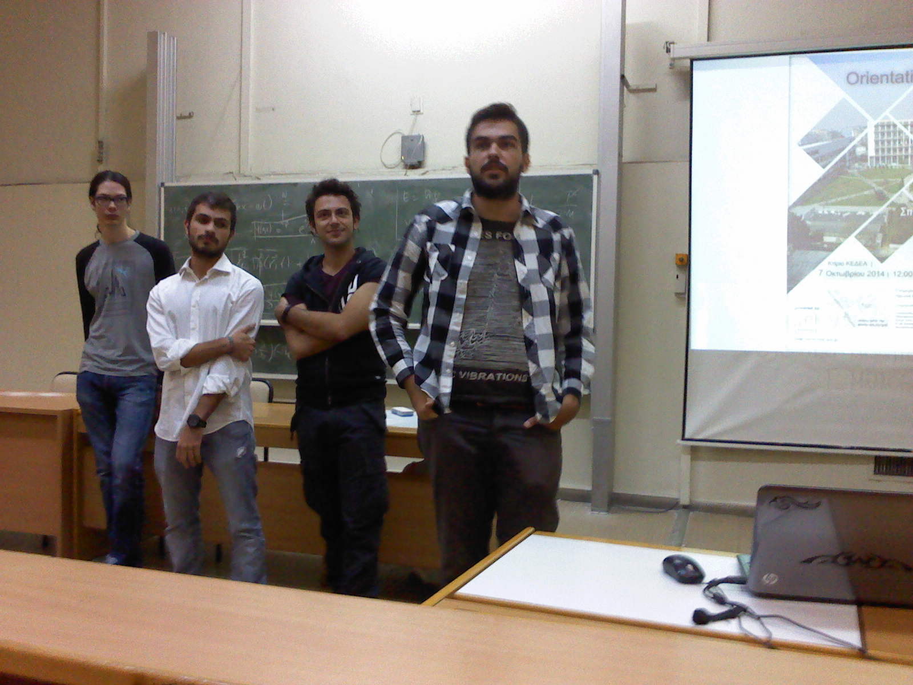

This week our Chapter introduced the first year of Computer Science students to the faculty and the chapter itself!

We explained what is ACM, why we do what we do, what were the previous things we organized and what are we planning to do nearby and some other stuff.

If you want to ask us something you can either straight talk to us at the university, [contact](/contact) us.

We are open to suggestions, hope to see you around to our events!

