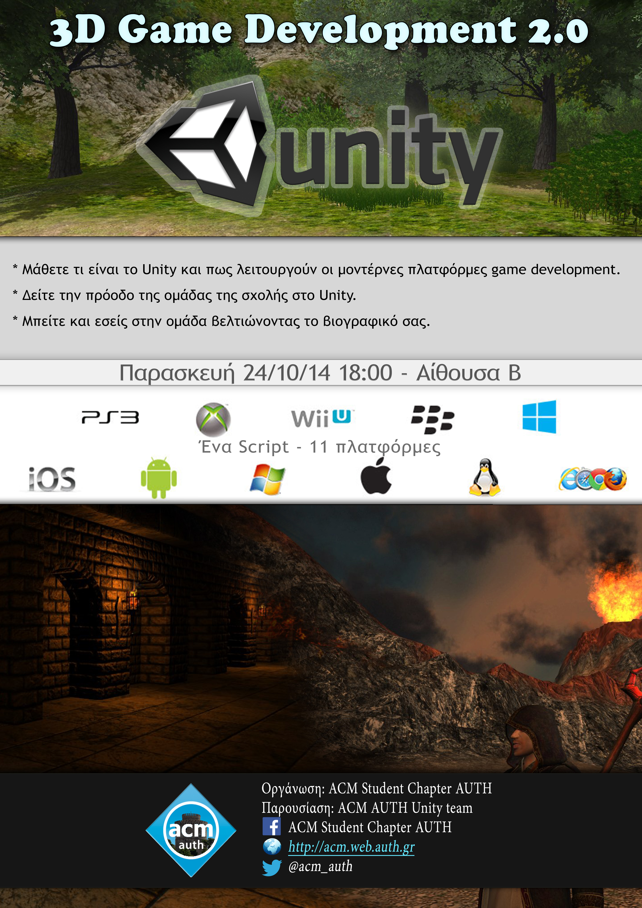
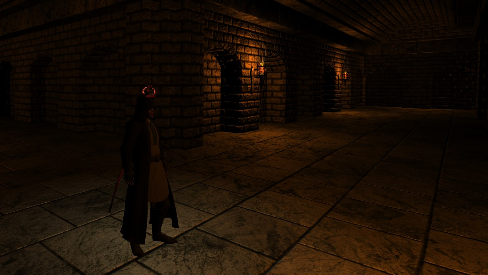
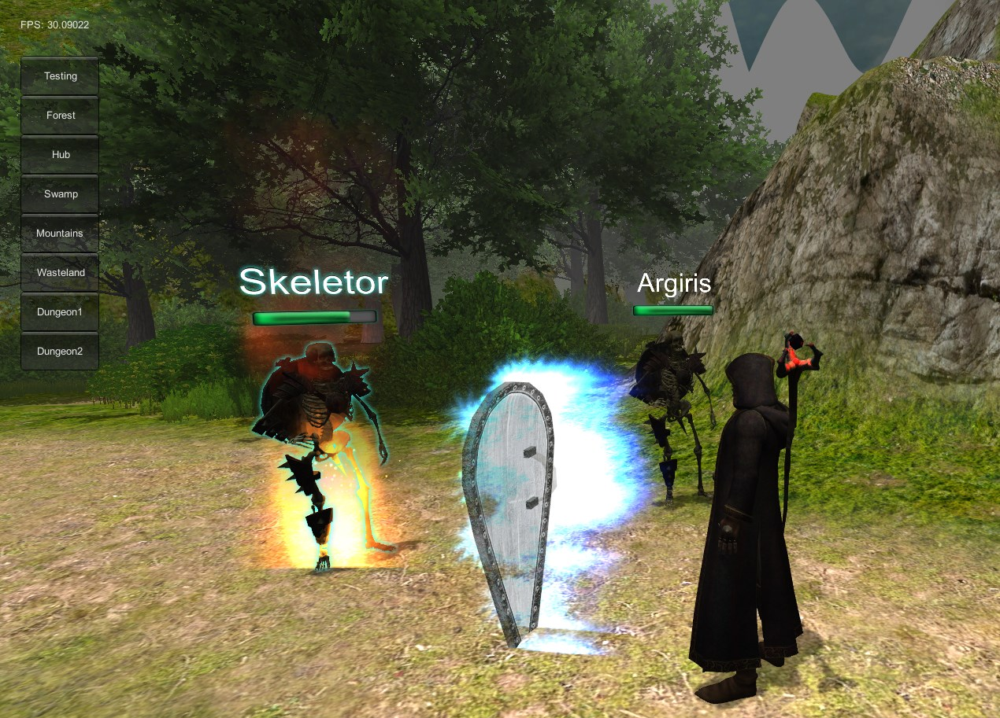
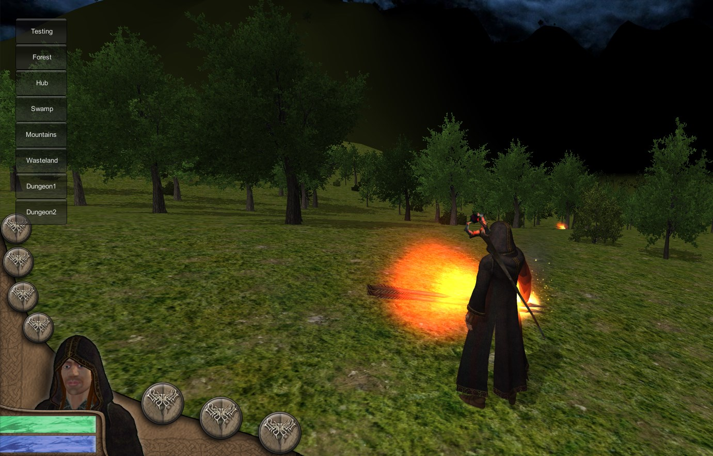
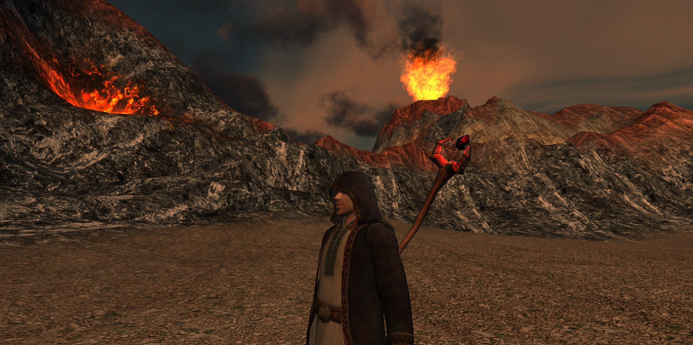
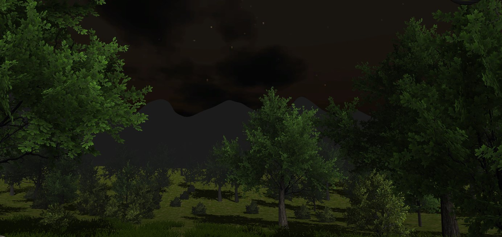
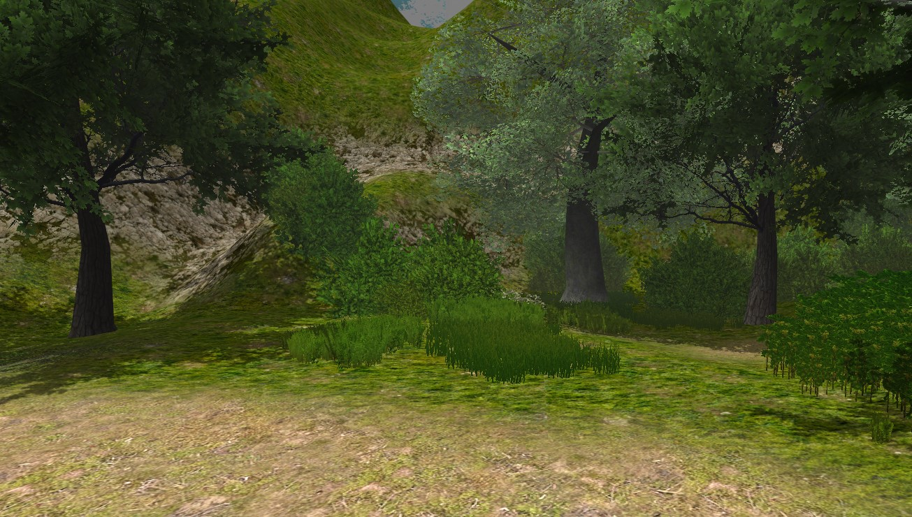
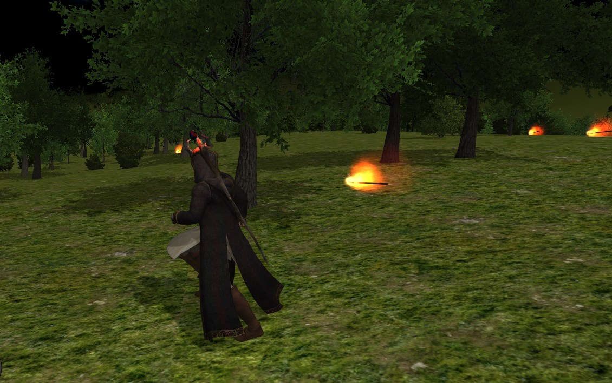

Attendance: **35 students** attended
If you would like to join our Unity team, please apply here: [Dragonstone Isle Application Form](https://docs.google.com/forms/d/1MLM0qrLho4-mkqifGyuGs3AHCVKjBgfT-BRag1YwLCE/viewform)

We are back! We are repeating last year's event. But this time, it's not just a general tutorial project, it's Dragonstone Isle!
Facebook [Event Page](https://www.facebook.com/events/293880604140771)

* Date : Friday 24 Oct 2014
* Time: 18.00
* Duration: ~2h
* Place: Biology Building, Floor 1, Room B

## Presenting

* Live tutorial: Nedelkos Miltos
* Dragonstone Isle Team: Panos Kolokotronis
* Level Design Techniques: Giannis Pierros
* Music in Games: Stavros Mischos

By coming to this event you will:

* Learn how a 3D game is developed in Unity framework.
* See how our unity team works and how they develop Dragonstone Isle.
* Join our team and learn how professional tools work.

Check some screenshots of our latest progress:

