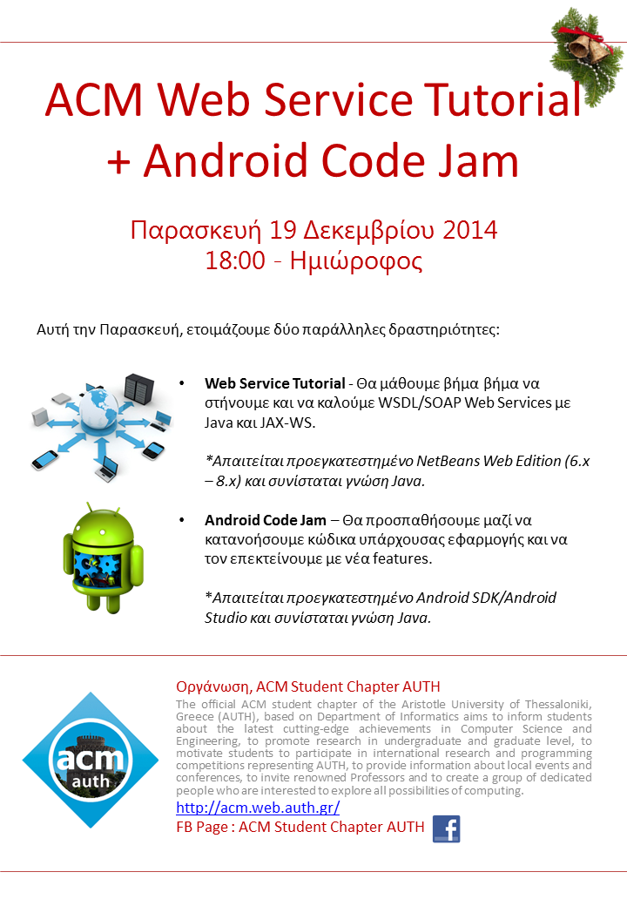
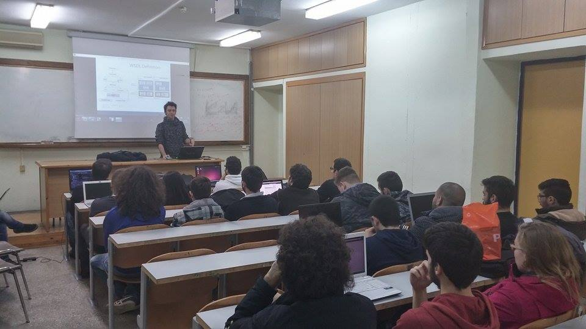
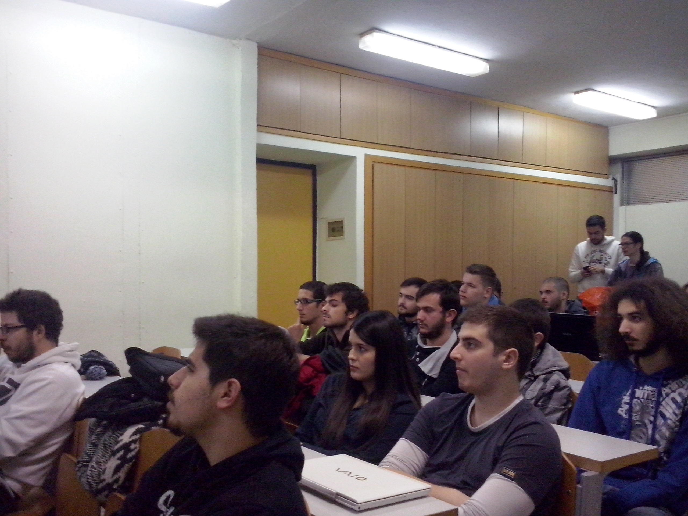

The material of the presetantion and the source code of PlugDroid follows:

* [Web Service Tutorial](../assets/web-service-and-code-jam/ACM-Web-Service-Tutorial.pdf) and [Code](../assets/web-service-and-code-jam/Code.rar)
* [Repository](https://bitbucket.org/psmert/plugdroid.git) for Plugdroid

**Attendance**: 25 students attended

