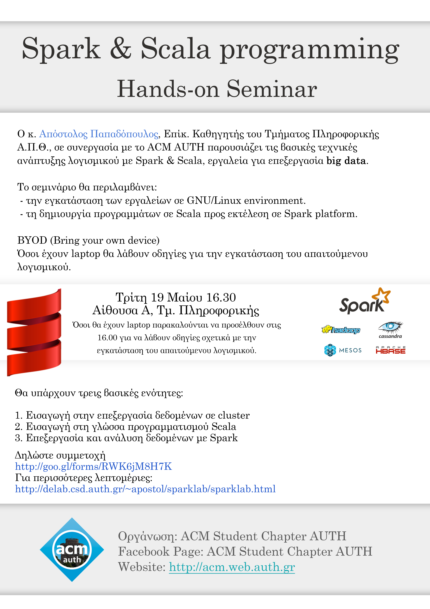

Ο κ. Απόστολος Παπαδόπουλος, Επίκ. Καθηγητής του Τμήματος Πληροφορικής Α.Π.Θ., σε συνεργασία με το ACM AUTH παρουσιάζει τις βασικές τεχνικές ανάπτυξης λογισμικού με Spark & Scala, εργαλεία για επεξεργασία big data.

Δηλώστε συμμετοχή [http://goo.gl/forms/RWK6jM8H7K](http://goo.gl/forms/RWK6jM8H7K)

Ακολουθείστε τις [οδηγίες εγκατάστασης](delab.csd.auth.gr/~apostol/sparklab/sparklab.html) πριν το σεμινάριο 

* [Facebook Event Page](www.facebook.com/events/1468395780118874/)
* Ημ/νία: Τρίτη 19 Μαίου 2015
* Ώρα: 16.30 (όσοι θα έχουν λαπτοπ παρακαλούνται να έρθουν στις 16.00)
* Διάρκεια: Περίπου 2 ώρες
* Μέρος: Αίθουσα Β, Τμ. Πληροφορικής Α.Π.Θ.
* Παρουσιάζει: [Απόστολος Παπαδόπουλος](http://delab.csd.auth.gr/~apostol/index.html), Επίκ. Καθηγητής του Τμήματος Πληροφορικής Α.Π.Θ.

Θα υπάρχουν τρεις βασικές ενότητες:

* Εισαγωγή στην επεξεργασία δεδομένων σε cluster.
* Εισαγωγή στην γλώσσα προγραμματισμού Scala.
* Επεξεργασία και ανάλυση δεδομένων σε Spark.

