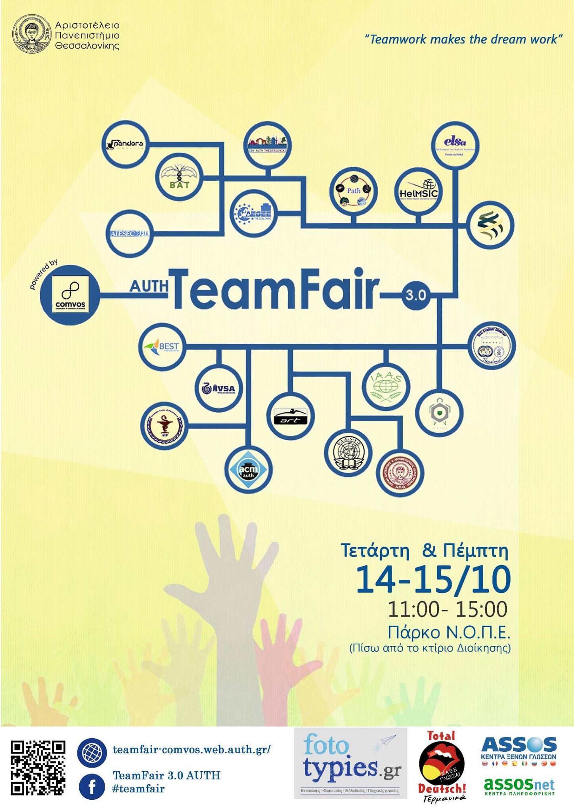

Comvos and the students&#39; teams of Aristotle University of Thessaloniki are holding Team Fair for the third time.

&nbsp;

Team Fair is a 2-day event, where students will have the opportunity to get to know and talk to most of the University volunteer teams, learn about their actions and potential and have fun with the organized activities during the hours of the event.

The aim of the event is, first and foremost, to show the truly innovative spirit of the students as well as their crave to change the world. We wouldn&#39;t miss it!

Join the Facebook <a href="https://www.facebook.com/events/396114657252225/">event</a>. 
  &nbsp;

  
<a href="http://comvos-uni.gr/wp-content/uploads/2015/10/---------------------------------------TeamFair-3.0.pdf">Here</a>, you can also find the booklet with all the participating teams.

  
&nbsp;

