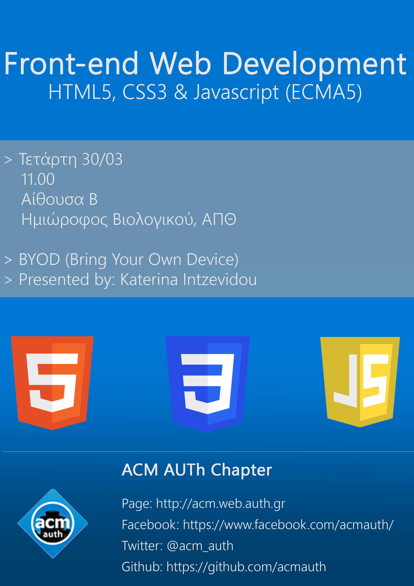

Introduction to **Frontend Web Development** basics.

Skim through the core features of:

* HTML5
* CSS3
* JS (ECMA 5)

In order to follow the live demos, please bring your own device.

There will also be discussions about ACM AUTh Chapter's new Web development team to be formed.

