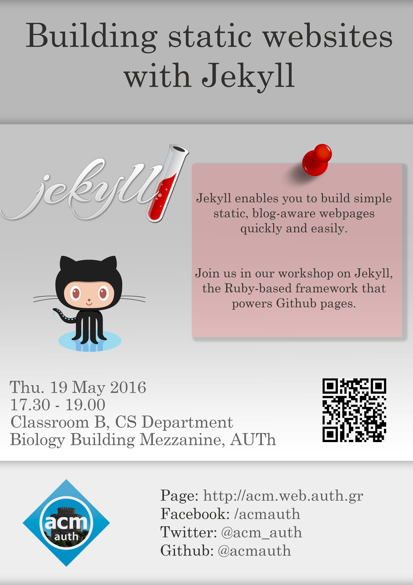

## About Jekyll

Jekyll is a Ruby-based framework that enables its users to build simple, static and blog-aware webpages without the need for a database.

You can erect your own websites, quickly and easily using Markdown, Liquid and/or HTML/CSS.

Last, you can readily deploy your site to github pages in few simple steps.

For more, come and join us in our workshop!

## Event Details:

```
19th May 2016, 17.30 - 19.00
Classroom B, CS department
Biology Building Mezzanine,
Aristotle University of Thessaloniki
```

<p><a href="../assets/jekyll-static-websites/poster.png"></a></p>
