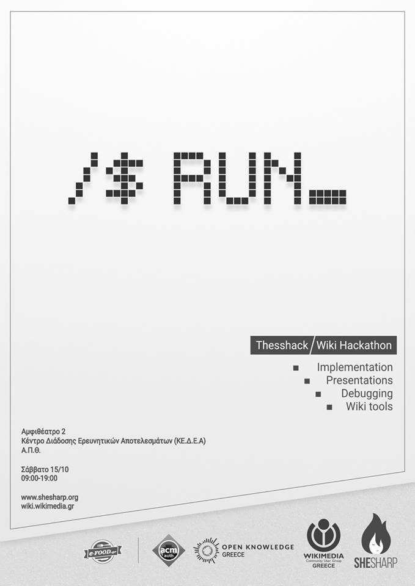

Thesshack is a hackathon aimed to improve the way Wikipedia, our favourite online encyclopaedia, works.

Just bring your laptop and your good mood and we promise a great event, full of creativity in an inspiring venue!

Wikimedia Österreich offers 2 full scholarships to attend Wikimedia Hackathon 2017 in Vienna (May 19-21) to the participants.

Catering is sponsored by E-Food.gr

* Registration [form](https://docs.google.com/forms/d/e/1FAIpQLScndvfWK2sggLG7jYiVjhHXM2tQjjszYBQuB-M_2Sfvf_xx2g/viewform)
* Facebook [event](https://www.facebook.com/events/333420780326262/)

## Venue

```
KEDEA AUTh
54636 Thessaloniki, Greece
```

<iframe src="https://www.google.com/maps/embed?pb=!1m18!1m12!1m3!1d3028.1510824116194!2d22.959971951482483!3d40.626549979240025!2m3!1f0!2f0!3f0!3m2!1i1024!2i768!4f13.1!3m3!1m2!1s0x14a838f97943b2bd%3A0xd56ca8d4f0abc5de!2sAristotle+University+Research+Dissemination+Center+(KEDEA)!5e0!3m2!1sen!2sfr!4v1475624914699" width="400" height="300" frameborder="0" style="border:0" allowfullscreen></iframe>

## Preliminary program

```
09:00–09:30 Registrations
09:30–10:00 Welcome
10:00–10:10 DBpedia
10:10–10:20 AutoWikiBrowser
10:20–10:30 Phabricator
10:30–10:40 API
10:40–11:00 theSShack Guidelines
11:00–13:30 Hacking
13:30–14:30 Food & Networking Break
14:30–18:30 Hacking
18:30–19:00 Closing Ceremony – Awards
19:00–20:00 Pizza time! (sponsored by e-food.gr)
20:00-03:00 After party
```

<p><a href="../assets/thesshack-wiki-hackathon/poster.png"></a></p>
