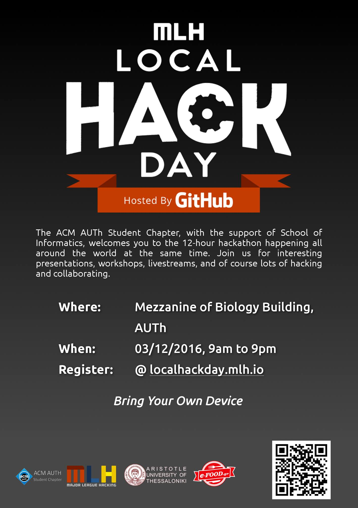

The ACM AUTh Student Chapter with the assistance of the AUTh Informatics Department are inviting you to this year's hackathon for students talking place simultaneously all over the world.

Find us on the 3rd of December on the Mezzanine of the Biology building in Aristotle University of Thessaloniki campus for a day of presentations, workshops, livestreams and meeting with the global tech community.

**Don't** forget to bring a laptop and appetite to learn and cooperate!

There will be plenty of coffee and pizza, an offer by [e-FOOD.gr](https://www.e-food.gr/)

## Schedule

```
09.00-10.30 Check-ins, coffee and chat, Hackathon introduction
10.30-11.15 Short Introduction to Git
11.30-12.30 Python/Flask Presentation and Hands on
12.30-13.00 Brainstorming, project ideas and team creation
13.00-14.00 Coding
14.00-14.30 Pizza Break, an offer by e-FOOD.gr
14.30-19.00 Coding
19.00-21.00 Project presentations and discussion
```

## Registration

Please register here before arriving:  
[https://localhackday.mlh.io/register/?id=thessaloniki](assets/mlh-local-hack-day/local-hack-day-2/)

Facebook event: [https://www.facebook.com/events/167948083675205/](https://www.facebook.com/events/167948083675205/)

<p><a href="../assets/mlh-local-hack-day-2/poster.png"></a></p>
