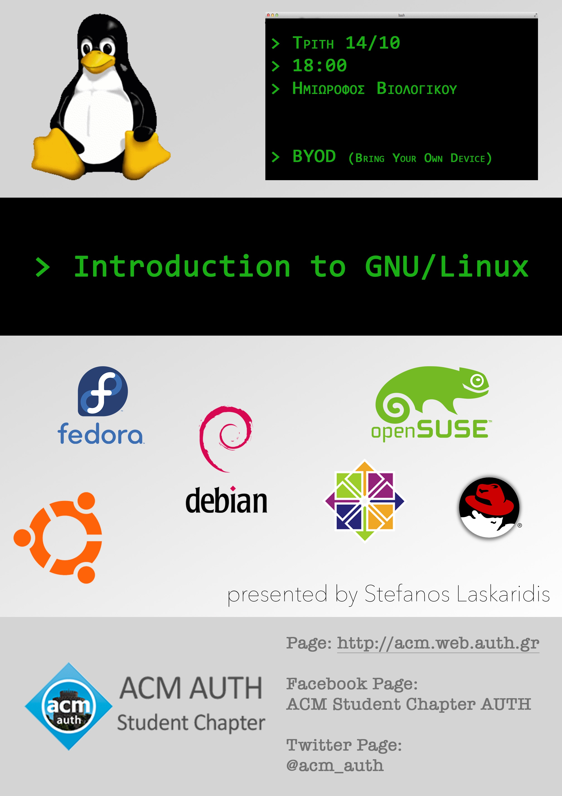

Την **Τρίτη 14/03**, στις **18:00**, θα πραγματοποιηθεί παρουσίαση πάνω σε βασικές αρχές
και λειτουργίες του λειτουργικού σύστηματος των GNU/Linux.

Πιο συγκεκριμένα, οι τομείς που θα αναλύσουμε είναι:

* Εισαγωγή στο Linux
* Διανομές Linux
* Εγκατάσταση Linux σε VM και dual boot
* Εκκίνηση συστήματος
* Linux Filesystem
* Package manager
* Βασικές εντολές bash shell
* Βασικό scripting σε bash
* Εργαλεία προγραμματισμού σε Linux

Η παρουσίαση θα βασιστεί σε Linux Ubuntu 16.10.

Διάρκεια: ~2h

Αίθουσα: Β

Προτείνεται να έχετε το laptop σας.

Δεν χρειάζεται κάποια εγγραφή.

Σας περιμένουμε!

