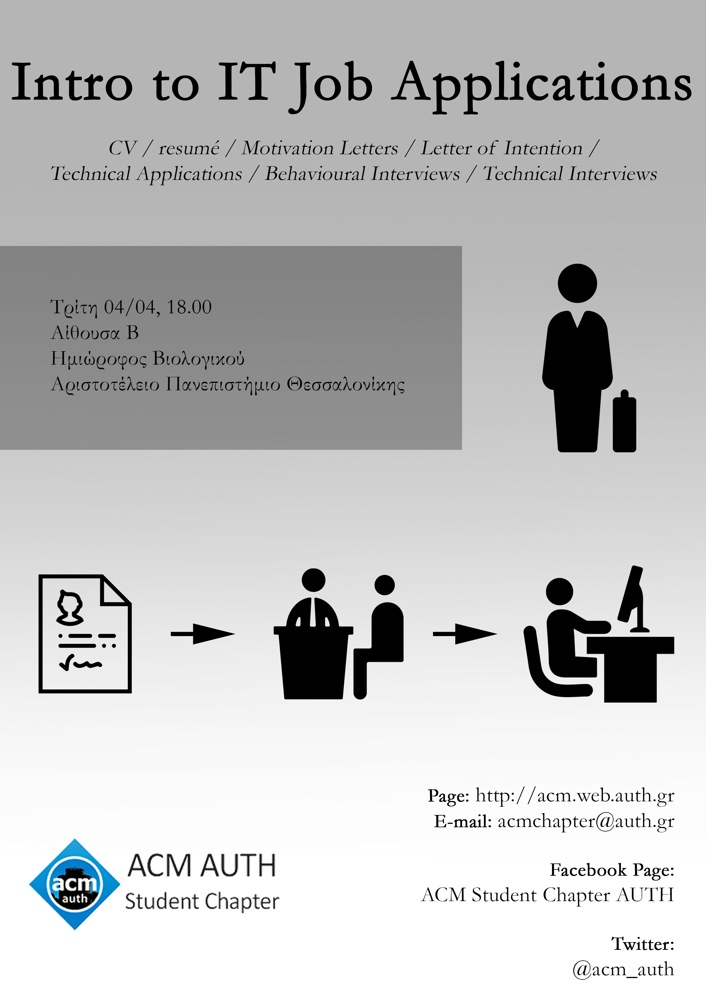

Την **Τρίτη 04/04**, στις **18.00**, θα πραγματοποιηθεί παρουσίαση από μέλη της ACM AUTH με θέμα την αίτηση για εργασία / πρακτική στον IT τομεα. Τα θέματα που θα καλυφθούν με βάση την προσωπική τους εμπειρία είναι:

* CV structure
* Tips for writing your CV
* Motivation Letter
* Technical Application (Optional)
* Technical Interview and Hackerrank
* Behavioral Interview
* Tests and other forms of evaluation
* On-site Interview

Αίθουσα: Β

Δεν χρειάζεται κάποια εγγραφή.

Σας περιμένουμε!

